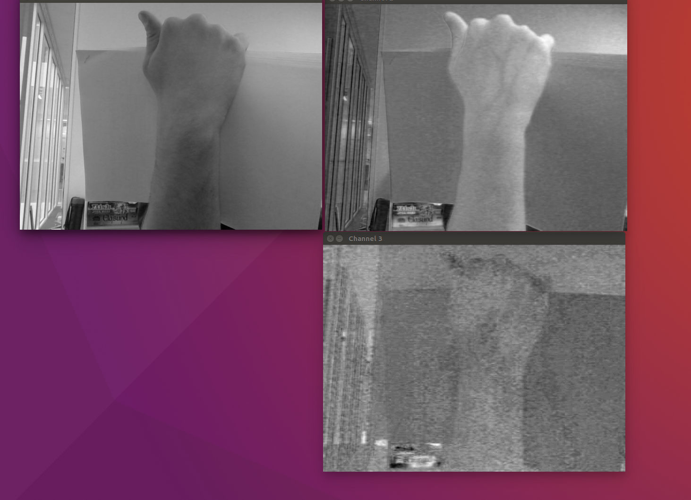

# PCA on your webcam stream

Small example to do PCA on images in openCV. This was mainly to inspect whether good forground/background segmentation was present in the PCs. Note that you need a webcam for this to work and openCV.

To install go to the source directory and write the following in the terminal:

```bash
cmake .
make
./test
```
You should now see three windows pop up with the three PCs.

The following image shows how my hand on a white background. A good separation is present in the first component, while smaller structures like veins are present in the second component. The PCs are shown, first in top left corner, second in top right corner and third in the bottom right corner.



I might add some more functionality in the future.
